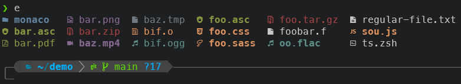
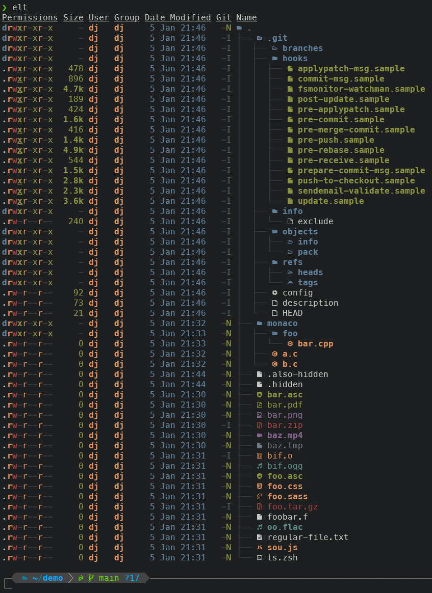

# zeza plugin

A Z Shell (`zsh`) plugin for managing and customizing '[eza]', the very colorful '[ls]' replacement. View the [install] guide to
get it for your operating system.


[TODO](TODO.md)

## Version

- Plugin: 0.1.0
- Updated for eza: 0.17.0

## Table of Contents

- [Features](#features)
- [Installation](#installation)
- [Aliases](#aliases)
- [Commands](#commands)
- [Customization](#customization)
- [Code Documentation](#code-documentation)
- [Learn More](#learn-more)

## Features

While `eza` needs nothing more than the `EZA_COLORS` environment variable to customize its color configuration, this plugin provides
a few extra conveniences for a more complete `eza` experience, such as:

1. an easy to read color configuration file,
2. a few sensible aliases, and
3. several helpful commands to manage `eza`

## Installation

### Oh My Zsh

1. Clone the repository to `.oh-my-zsh/custom/plugins` or `$ZSH_CUSTOM`

```shell
git clone --depth=1 https://github.com/duggum/zeza.git ${ZSH_CUSTOM:-$HOME/.oh-my-zsh/custom}/plugins/zeza
```

2. Add `zeza` to the plugins array in your `.zshrc` file:

```shell
plugins=(... zeza)
```

Note: you have to [install] `eza` before using this plugin.

## Commands

`zeza` provides the following commands

| Command   | Description                                                      |
|:----------|:-----------------------------------------------------------------|
| help      | print a help message                                             |
| configure | generate a customizable configuration file                       |
| default   | setup `eza` to use the default, builtin color configuration        |
| demo      | print color codes and descriptions in their assigned colors      |
| nocolor   | setup `eza` to display completely colorless output                 |
| refresh   | refresh `zeza` to reflect changes made to a configuration          |
| reset     | prepends the 'reset' flag to the EZA_COLORS environment variable |
| restore   | restore a previous custom configuration file                     |
| status    | show the current status of the `zeza` plugin environment           |
| tables    | show formatted color tables using the terminal color scheme      |

For help with individual commands, run `zeza <command> --help`

### Configure

As the name implies, this will be the primary command you use to configure `eza`.

There is no need to edit `EZA_COLORS` directly. The `configure` command will copy
a thoroughly commented and fully customizable default configuration file called
`.zeza_custom.eza` to a location of your choosing (default is `$HOME`). Simply
edit the color assignments and run `zeza refresh` to apply your changes.

There is a handy [cheatsheet](docs/cheatsheet.md) available in the `docs`
directory to help you if needed.

### Tables

The `tables` command can be especially helpful as it displays a variety of color tables that demonstrate the rendering
behavior of your terminal emulator.

For example:

`zeza tables -nb` displays a color table showing normal foreground colors on bright background colors


Another useful tool is `zeza tables --test` which will run a simple test to help you determine if your terminal emulator
renders bold text as bold, bright, or both bold and bright. This can be useful as setting your emulator to only render
bold text as bold allows for many more color combinations from among the base 16 color palette.

Feel free to jump down the [rabbit hole] if you wish to know more.


Run `zeza tables --help` for detailed instructions.

## Aliases

The aliases provided use the following default `eza` command options:

- `--git`
- `--icons`
- `--group`
- `--group-directories-first`
- `--sort=name`

If you wish to set your own default command options, simply add the `EZA_CMD_OPTS`
environment variable to your `.zshenv` or `.zshrc` file and export it:

```shell
export EZA_CMD_OPTS="<your options here>"
```

When you reload your shell, `zeza` will replace the internal default options with
the ones you provided via `EZA_CMD_OPTS`. See: `man eza` for all available options.

### Alias Preview

The following aliases are provided. They too can be overridden in your `.zshenv`
or `.zshrc` file as desired.

```shell
# base implementation with default options
alias e='eza --git --icons --group --group-directories-first --sort=name' 
```


```shell
# mid form implementation (plus -l, -h, and --no-user options)
alias el='e -lh --no-user'
```


```shell
# long form implementation (plus -l, -a, -g, and -h options)
alias ell='e -lagh'
```


```shell
# mid form tree listing
alias et='el --tree'
```


```shell
# long form tree listing
alias elt='ell --tree'
```



### LS Replacement

This plugin does not assume that you want to replace `ls` with `eza`. If you wish
to do so you can simply create your own aliases in your `.zshenv` or `.zshrc` file.

For example:

```shell
alias ls='eza'
alias ll='eza -la'
```

## Customization

You may add your own aliases in your `.zshenv` or `.zshrc` files as you see fit. Additionally, the default aliases listed
above may be overriden by providing your own aliases with the same names.

## Code Documentation

Documentation for the main code files can be found at:

* [zeza](docs/zeza.md)
* [zeza-main](docs/main.md)
* [zeza-utils](docs/utils.md)

## Learn More

ANSI Color Sequence Cheatsheet

- [Color Code Cheatsheet](docs/cheatsheet.md)

For `eza` see the following man pages:

- [eza(1)]
- [eza_colors(5)]
- [eza_colors-explanation(5)]

For ANSI colors in terminal emulators:

- [Everything] you ever wanted to know about ANSI escape codes
- A wikipedia article covering the use of [SGR parameters]
- [ECMA 48] 5th edition

[eza]: https://eza.rocks "eza"
[ls]: https://www.gnu.org/software/coreutils/manual/html_node/ls-invocation.html "ls"
[install]: https://github.com/eza-community/eza/blob/main/INSTALL.md "install"
[rabbit hole]: https://www.google.com/search?q=terminal+render+bold+as+bright "Google search about bold terminal color rendering"
[eza(1)]: https://github.com/eza-community/eza/blob/main/man/eza.1.md "man eza"
[eza_colors(5)]: https://github.com/eza-community/eza/blob/main/man/eza_colors.5.md "man eza_colors"
[eza_colors-explanation(5)]: https://github.com/eza-community/eza/blob/main/man/eza_colors-explanation.5.md "man eza_colors-explanation"
[Everything]: https://notes.burke.libbey.me/ansi-escape-codes "everything about ANSI escape codes"
[SGR parameters]: https://en.wikipedia.org/wiki/ANSI_escape_code#SGR_(Select_Graphic_Rendition)_parameters "wikipedia article on sgr parameters"
[ECMA 48]: https://ecma-international.org/wp-content/uploads/ECMA-48_5th_edition_june_1991.pdf "ECMA 48 5th edition PDF"
